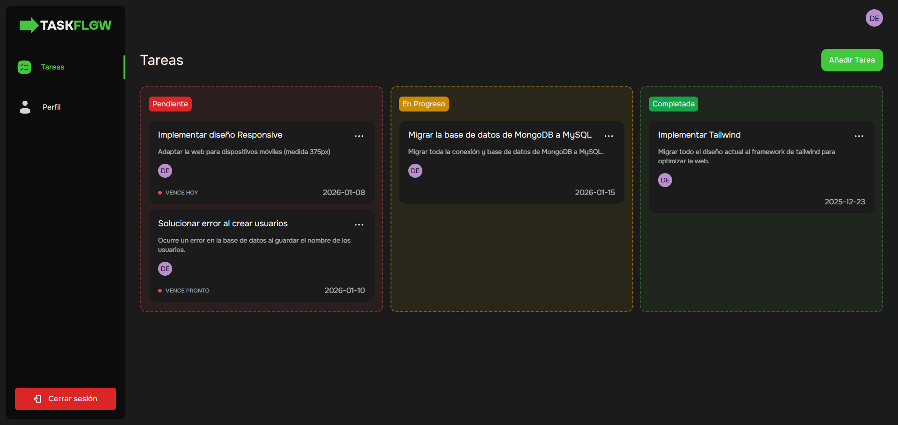

# Sistema de gestión de tareas para estudiantes, profesionales y equipos

## Tabla de contenidos

  - [Captura de pantalla](#captura-de-pantalla)
  - [Stack tecnológico](#stack-tecnológico)
  - [Autores](#autores)
  - [Licencia](#licencia)

### Captura de pantalla

### Stack tecnológico

- [Laravel](https://laravel.com/)
- [Tailwind CSS](https://tailwindcss.com/)
- [Alphine.js](https://alpinejs.dev/)
- [MySQL](https://www.mysql.com/)

### Autores

- Website - [Daniel Villafranqui](https://portafolio-danvc.netlify.app/)
- Frontend Mentor - [@dan-vc](https://www.frontendmentor.io/profile/dan-vc)

### Licencia

El framework de Laravel es un software de código abierto licenciado bajo la [MIT license](https://opensource.org/licenses/MIT).
